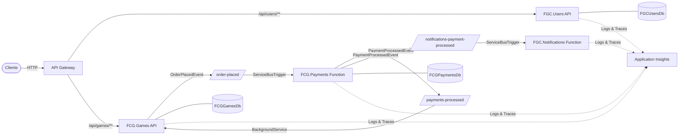
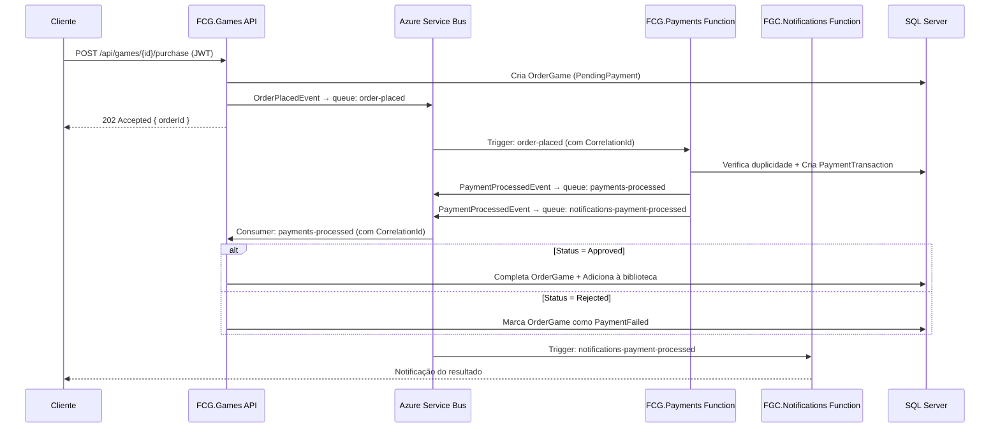
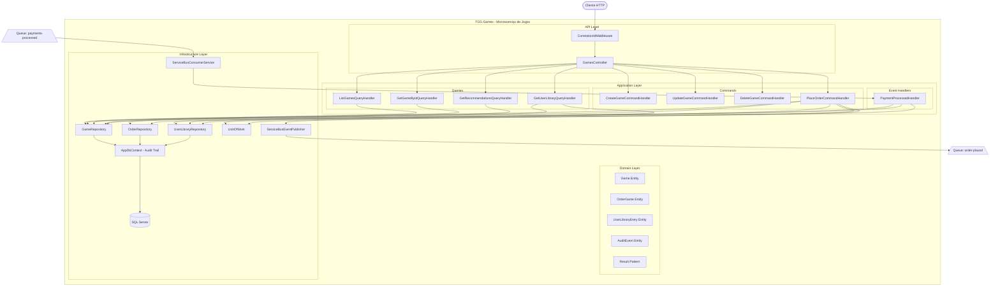

# FCG.Games API

Microsserviço de catálogo de jogos, sistema de compras e biblioteca do usuário, desenvolvido com .NET 8 e ASP.NET Core Web API. Projeto da **Fase 3 do Tech Challenge — PosTech FIAP**.

## Fluxo de Comunicação entre Microsserviços



## Fluxo de Compra



## Diagrama de Arquitetura



## Arquitetura

O projeto segue **Clean Architecture** com **CQRS** (sem MediatR), organizado em 4 camadas:

```
src/
├── FCG.Games.Domain/           # Entidades, Value Objects, Eventos, Interfaces (zero dependências NuGet)
├── FCG.Games.Application/      # Commands, Queries, Handlers, DTOs
├── FCG.Games.Infrastructure/   # EF Core (SQL Server), Azure Service Bus, Repositórios, UnitOfWork
└── FCG.Games.Api/              # Controllers, Middleware, Startup (JWT + Swagger)
tests/
├── FCG.Games.Domain.Tests/     # Testes de Value Objects (Result/Error)
├── FCG.Games.Application.Tests/# Testes de Handlers com NSubstitute
└── FCG.Games.Infrastructure.Tests/ # Testes do AppDbContext (audit trail)
```

**Fluxo de dependências:** Domain ← Application ← Infrastructure; Api → Application + Infrastructure

## Endpoints

| Método | Rota | Auth | Descrição |
|--------|------|------|-----------|
| `GET` | `/api/games` | Não | Lista todos os jogos do catálogo |
| `GET` | `/api/games/{id}` | Não | Busca jogo por ID |
| `POST` | `/api/games` | Admin | Cria novo jogo |
| `PUT` | `/api/games/{id}` | Admin | Atualiza jogo existente |
| `DELETE` | `/api/games/{id}` | Admin | Remove jogo do catálogo |
| `POST` | `/api/games/{gameId}/purchase` | JWT | Solicita compra de um jogo |
| `GET` | `/api/games/library` | JWT | Biblioteca de jogos do usuário |
| `GET` | `/api/games/recommendations` | JWT | Top 10 jogos recomendados |

### Detalhes da Compra (`POST /api/games/{gameId}/purchase`)

- Extrai `userId` do token JWT (claim `sub`)
- Cria `OrderGame` com status `PendingPayment`
- Publica `OrderPlacedEvent` na queue `order-placed` do Azure Service Bus com `CorrelationId` para rastreamento distribuído
- Retorna `202 Accepted` com `{ orderId, status }`

**Erros tratados:** `404` (jogo não encontrado), `409` (já possui ou pedido pendente)

## Domínio

### Entidades

| Entidade | Campos principais |
|----------|-------------------|
| `Game` | Id, Title, Description, Genre, Price, CreatedAtUtc, UpdatedAtUtc |
| `OrderGame` | Id, UserId, GameId, Price, Status, IsProcessed, CorrelationId |
| `UserLibraryEntry` | Id, UserId, GameId, CreatedAt |
| `AuditEvent` | EventId, EntityName, EntityKey, Action, Data, CreatedAtUtc |

### Eventos

| Evento | Queue | Direção |
|--------|-------|---------|
| `OrderPlacedEvent` | `order-placed` | Publicado → FCG.Payments consome |
| `PaymentProcessedEvent` | `payments-processed` | FCG.Payments publica → Consumido |

## Rastreamento Distribuído (Correlation ID)

O `CorrelationId` é propagado de ponta a ponta:

1. **Middleware** captura/gera `x-correlation-id` do header HTTP e cria `Activity`
2. **ServiceBusEventPublisher** usa `Activity.Current?.Id` para setar `ServiceBusMessage.CorrelationId`
3. **ServiceBusConsumerService** lê `CorrelationId` da mensagem recebida, restaura a `Activity` e enriquece os logs

## Configuração

```json
{
  "ConnectionStrings": {
    "DefaultConnection": "Server=tcp:<server>;Database=<db>;..."
  },
  "ServiceBus": {
    "ConnectionString": "Endpoint=sb://<namespace>.servicebus.windows.net/;...",
    "OrderPlacedQueue": "order-placed",
    "PaymentProcessedQueue": "payments-processed"
  },
  "Jwt": {
    "Key": "<chave-secreta>",
    "Issuer": "<issuer>",
    "Audience": "<audience>"
  },
  "ApplicationInsights": {
    "ConnectionString": "<connection-string>"
  }
}
```

| Configuração | Vazia/ausente | Comportamento |
|--------------|---------------|---------------|
| `ConnectionStrings:DefaultConnection` | sim | Falha ao iniciar |
| `ServiceBus:ConnectionString` | sim | Usa `NoOpEventPublisher` (eventos descartados) |
| `Jwt:Key` | sim | Validação de signing key desabilitada |
| `ApplicationInsights:ConnectionString` | sim | Logs apenas no console |

## CI/CD

Pipeline GitHub Actions (`.github/workflows/ci-cd.yml`):

- **CI** (push + PR na master): restore → build → test
- **CD** (apenas push na master): build Docker → push ACR → deploy Azure Container App

## Build & Run

```bash
# Build
dotnet build FCG.Games.sln

# Executar API (http://localhost:5105)
dotnet run --project src/FCG.Games.Api/FCG.Games.Api.csproj

# Executar testes (19 testes)
dotnet test FCG.Games.sln
```

## Docker

```bash
docker build -t fcg-games .
docker run -p 5105:8080 \
  -e ConnectionStrings__DefaultConnection="Server=tcp:..." \
  -e Jwt__Key="<chave>" \
  fcg-games
```

## Testes

19 testes com xUnit + NSubstitute:

| Projeto | Testes |
|---------|--------|
| Domain (Result/Error) | 6 |
| Application (Handlers) | 10 |
| Infrastructure (Audit Trail) | 3 |

## Observabilidade

- **Serilog** com sinks para Console e Application Insights
- **CorrelationIdMiddleware** propaga `x-correlation-id` entre requests e mensagens do Service Bus
- **Audit Trail** automático via override de `SaveChangesAsync` no `AppDbContext`
- **Application Insights** para logs, traces e métricas centralizados

## Tecnologias

- .NET 8.0 / ASP.NET Core Web API
- Entity Framework Core 8 (SQL Server)
- Azure Service Bus (Queues)
- Serilog + Application Insights
- xUnit + NSubstitute
